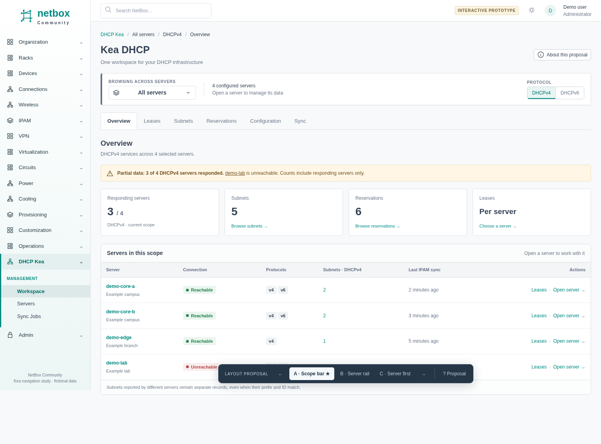
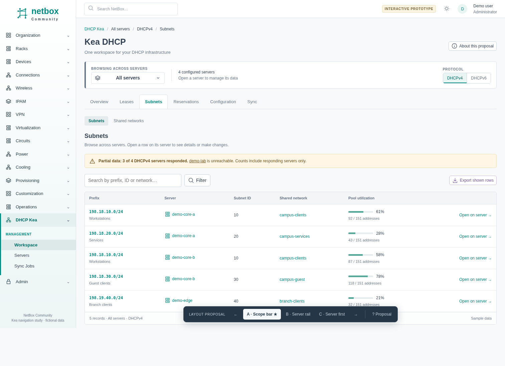
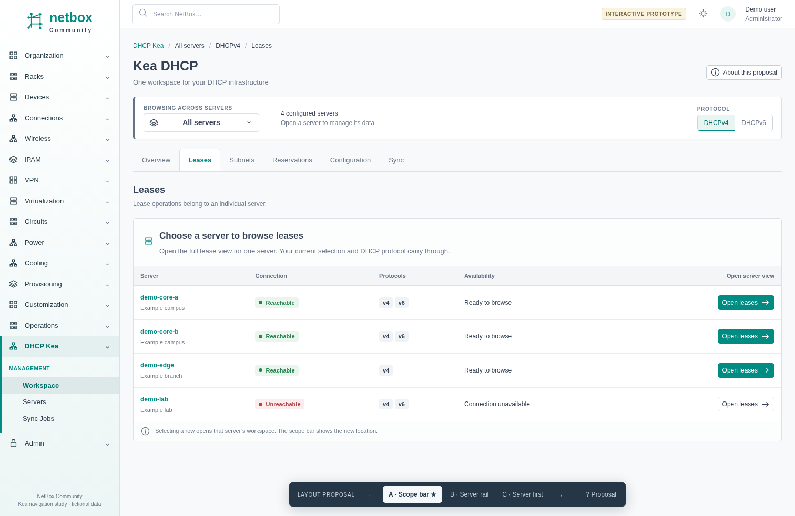
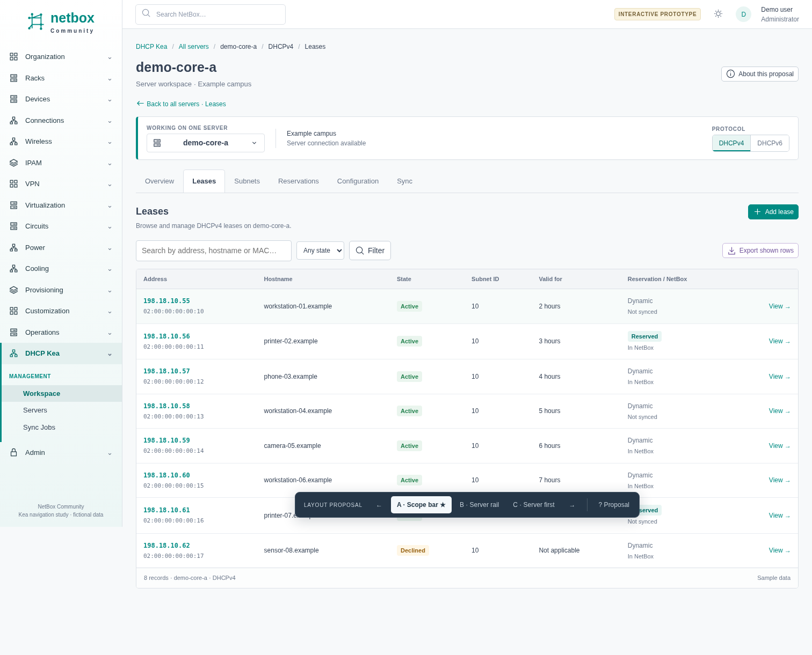

<!--
SPDX-FileCopyrightText: 2026 Marcin Zieba
SPDX-License-Identifier: Apache-2.0
-->

# Kea DHCP navigation prototype

The maintainer selected **A: Scope bar** on 2026-10-09.
This branch preserves the reviewed prototype as a design reference.
It contains no application changes and is not intended to merge into a release branch.

## Open the prototype

Download `index.html` and open it in a browser. It is a single file with no dependencies.
GitHub displays the source; use **Download raw file** to open the interactive version locally.

Alternatively, from the repository root:

```sh
python -m http.server 8873 --bind 127.0.0.1 --directory docs/prototypes/kea-scope-bar
```

Open `http://127.0.0.1:8873/?variant=A`.

All records are fictional. Forms preview their destination and do not change a server.
The CSV button downloads fictional rows. No production credentials or services are needed.

## Selected direction

- Use one workspace with an explicit all-server, selected-server, or single-server scope.
- Keep the scope and DHCP protocol visible in a persistent bar.
- Keep the same main sections in each scope.
- Open the server workspace when exactly one server is selected.
- Use combined subnets and reservations for discovery. Open records on their owning server.
- Replace combined lease results with a server chooser that opens the complete server lease view.
- Preserve the return path to the previous combined view and its filters.
- Show incomplete data, unreachable servers, and unsupported protocols explicitly.
- Keep NetBox styling and native application behavior during implementation.

B: Server rail and C: Server first remain in the bottom switcher as comparison material.
Only A is selected for implementation. The prototype is a visual reference, not production code.
Its sample counts, row contents, form fields, and JavaScript state are illustrative.

## Walkthrough

1. Open **Subnets**, then **Open on server**. The scope changes to that server.
2. Use **Back to all servers** to restore the catalogue.
3. Open **Leases**, then choose a server to enter its lease view.
4. Use the scope selector to choose two servers, or exactly one server.
5. Select DHCPv6 on `demo-edge`, or open `demo-lab`, to see explicit availability states.
6. Use the bottom switcher to compare the archived alternatives.

## Selected proposal screenshots

### All-server overview



### Combined subnet catalogue



### Lease server chooser



### Server lease view



## Provenance and validation

Archived from the standalone prototype in `/tmp/kea-ui-prototype/index.html`.
The source UI was reviewed on `develop`. The archive branch starts from remote commit
`3901123d9ffff1a2c1eb6bc38ecda52f0e4f6d72`.

Browser checks covered scope selection, catalogue-to-server navigation and return,
lease handoff, search, form destination labels, browser Back, unavailable services,
all three layouts, and a narrow viewport. No JavaScript errors occurred in those checks.
Production implementation needs its own integration and browser coverage.
